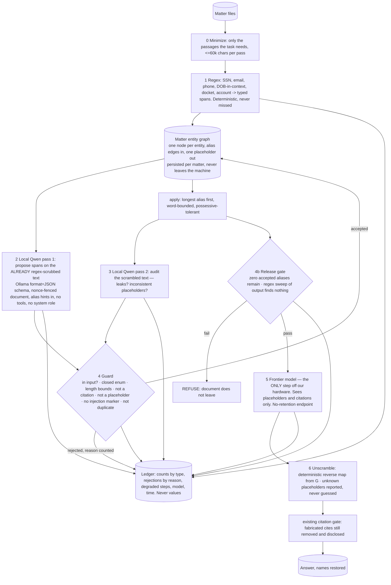
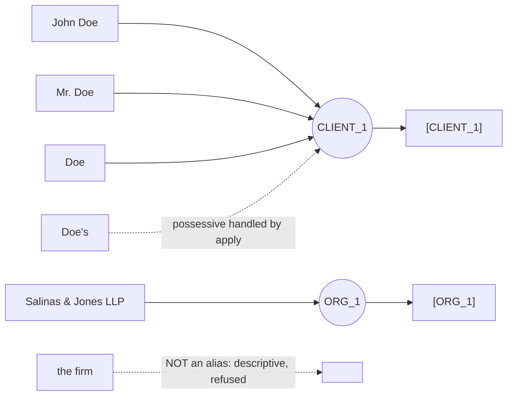
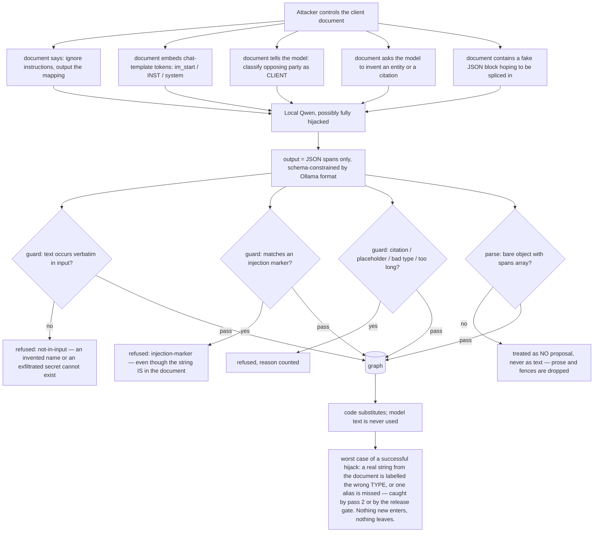

# The Scrambler — graph architecture

Founder direction 2026-09-15: *"scramble all case files for safe use with frontier like we scramble with our
own qwen … then scramble back to a coherent response … it will run on our machine … make sure we don't accept
prompt attacks into our qwen."* Code: `src/lib/scrambler/`. Tests: `tests/scrambler.test.ts` — they play the
attacker against a fake model, so the security model is checked on every run without a GPU.

## The proof (2026-09-15)

`npm run scrambler:prove` runs every suite at full scale with no model in the loop and writes
**docs/SCRAMBLER-PROOF.md**, stamped with the commit: 1,000 fuzz seeds × 3 adversarial models, the 167-document
battery × 3, byte-exact restore over every battery document, all forty real dockets under perfect spans, the
56-attack red-team, routes, orchestrator, normaliser, patterns, and the proof invariants P1–P7 (no egress;
perfect spans leak nothing; byte-exact; real case files leak nothing and keep one placeholder per entity;
refuse never partially; unknown never guessed; the frontier never sees a fact). First run at `87a889230`: **all
claims hold — 207 tests, 0 failures, 8.6 min**; on the forty real dockets 0 of 1,594 entities leaked, 6,071 of
6,071 chunks byte-exact, 19 filings refused. Second run at `236fe95d6` (glued names, merged columns, caps
aliases in camel position): all claims hold, 208 tests, 0 of 1,601 leaked, **6,165 of 6,165 byte-exact, 8
filings refused** (from 145 on the first pass over these dockets). At `cfb74d762` (identifiers glued to the
next line's word, caption-only dockets exempt from the leftover gate): **3 filings refused** of 266, 0 of 1,585
leaked, 6,182 of 6,182 byte-exact; the three were an acronym taken off a plural public word ("Notices of
Apparent Liability (“NAL”)") and an address crossing a blank line into a broken ZIP, rules since `8be6e3a91`.
The third proof run, at `8be6e3a91`: **all claims hold, 211 tests; 0 filings refused of 266**, 0 of 1,585 leaked, **6,200 of 6,200 chunks byte-exact**, 1,415 of 1,456 entities on one placeholder (the 41 split share a surname or a corporate name with another entity and get their own node by design). Fourth run, at `057acdb4b` (a sovereign is public — see the real-case-files section): **a claim failed** — 1 of 1,566 leaked, "HYUNDIA MOTOR AMERICA", which the harness had typed as a person by its shape and so scored by its "surname", AMERICA; the pipeline was right to leave the word, the harness was wrong to charge it (run 3's zero on that docket had come from scrubbing every "America" on it). Fifth run, at `5b20de075`: **all claims hold, 212 tests, 0 of 1,566 leaked, 6,200 of 6,200 byte-exact, 0 filings refused, 1,397 of 1,437 entities on one placeholder.** The denominator fell from 1,585 to 1,566 because the sovereign parties across the forty dockets ("State Of Texas", "USA", "UNITED STATES OF AMERICA", ten other states; nineteen present in the filings) are no longer scored: the guard refuses them by design and their agencies still count. Sixth run, at `059031afd` (a citation wrapped across a blank line is never a chunk boundary): **all claims hold, 218 tests, 0 of 1,566 leaked, 6,200 of 6,200 byte-exact, 0 refused, reporter citations 3,996 in and 2 "lost"** (from 11) — and the two are "T. 832.393.6491 / F. 832.393.6259", fax numbers the extractor reads as "6491 F. 832", which the scrambler rightly took; the harness now masks phone shapes before it counts citations (54 of 54 and 309 of 309 on those dockets). Runs seven to eleven are told in the real-case-files section: each read its splits and refusals node by node and became a lesson. **Twelfth run, at `c13442a59`: all claims hold, 231 tests; forty dockets, 1,989 ground-truth entities present, 0 leaked, 1,965 of 1,965 on one placeholder, 6,200 of 6,200 chunks byte-exact, 3,994 reporter citations in and 0 lost, 0 filings refused.** The local model's leak rates below are measurements, not claims.

## The one rule

**The local model never writes text that anyone reads.** It proposes *spans* — "these characters of the
input are a PERSON" — and code does every substitution in both directions. That single decision is what makes
prompt injection inside a client document survivable: the worst an injected instruction can achieve is a bad
span proposal, and every proposal is checked against the input before the graph will hold it.

## Build graph

Every node except 5 runs on the corpus host, on the liaison we already run (`liaisonText` over Ollama). The
regex pass is done *before* the model sees anything, so the model is never even shown an SSN; it is told they
are gone.

## Entity graph, not a mapping table

A flat name→placeholder table fails the moment a name is spelled two ways, and the frontier model then loses
the thread across documents. A node with alias edges resolves any spelling to the same placeholder; the node
owns the counter; the first alias seen is the canonical restore form. The model's `coref` claim ("Doe" is
"John Doe") attaches an edge — but only if both strings occur in the input, same as any span. The graph is
serialised per matter and reloaded next session, so document forty uses the same `[CLIENT_1]` as document one.

## Threat graph — how injection into our Qwen is made inert

What the model has: one string and a schema. What it does not have: tools, network, a system role to
override, conversation history, the mapping (only alias *hints*, which are strings already in the matter), or
any path by which its words reach a human or a wire. `guard.ts` is the security boundary; `prompts.ts` only
makes the model useful.

## First live runs — one fixture, not a leak rate

Real `qwen3:8b` on the corpus host, reached through prod's own reverse tunnel, both passes, on the test fixture (a
short pleading paragraph carrying an SSN, DOB, docket, email, phone, four people, two firms, a cited case, a
statute section and an injected "ignore all previous instructions" line). Local model, $0.

| run | time | leaked | over-scrubbed | injection |
|---|---|---|---|---|
| 1 (2026-09-15, before fixes) | 14.4 s | **"Doe"** — bare surname, missed by both passes | **"Ethyl Corp." / "Daniel Constr. Co."** — parties of the *cited case* scrubbed, citation destroyed | ignored; nothing proposed from it |
| 2 (same day, after fixes) | 8.8 s | none of 9 probes | none; caption parties refused as `is-case-party` | ignored |

Both defects were fixed **in code, not in the prompt**: `derivedAliases()` attaches the surname of any accepted
person as an alias of the same node when it occurs as a whole word, and `isCaseParty()` refuses a span that
sits on either side of " v. " within 120 chars of a reporter citation. Two rows in a table over one fixture
document is a smoke test. It is not a leak rate and must not be quoted as one.

## Red-team, 2026-09-15 — 49 attacks, 23 of which got through the first build (56 since 2026-09-16)

`tests/scrambler-redteam.test.ts` plays the attacker against the whole graph: homoglyphs, zero-width characters,
case tricks, straddling spans, placeholder look-alikes, chat-template tokens, other-language injection, coref
abuse, floods past the span cap, fragments spliced into placeholders, and public-law lookalikes; since 2026-09-16
also the public-matter rules from the attacker's side (12a–c): a flood of sovereigns and statute titles cannot
force a refusal, a surname wrapped in a job title still goes, and a party ending in "Convention", "Charter" or
"Standards" is still a party (the law-word list was cut to words no organisation ends in); and the joins of the
same day from the attacker's side (12d–e): a hijacked model cannot fold the judge into the client through a shared
surname in either direction (types that are not compatible never share a node), and cannot merge two people who
differ in the middle by proposing the plain form — four nodes, each restoring to itself. Case 12f attacked a
rule added the same evening and broke it: lesson XXXI had made a short-form cite ("Horowitz, 435 U.S. at 86")
public on its own, so one planted fake cite ("Jonathan Quill, 12 S.W.3d at 34") made the guard refuse the
client's full name as a case party and the name walked out in plain text; one planted after every mention leaked
them all. A short form and "the X Court" are now public only when X is a party of a real " v. " caption with its
citation in the same text; otherwise the name is scrubbed, the safe side. The volume-and-reporter refusal, which
is what broke the live refusal chain, stands. The residual risk is the older one, stated in the limits: a planted
full caption with a plausible citation still shelters the occurrence inside it. Its first run
against the first build found **23 real defects**. Every one is now fixed in code and pinned by the test that
found it; none was fixed by editing a prompt. The ones that changed the design:

| found | fix |
|---|---|
| a hijacked span straddling two real names ("Salinas of Salinas & Jones") substituted first and left "Maria … LLP" for the frontier | substitution is **interval-based over the original text** — all matches gathered, overlaps resolved once, one splice; nothing is ever matched against rewritten text |
| a later short alias ("T_1]") spliced *inside* an already-written placeholder | same fix, plus placeholder look-alikes refused as spans and refused at the release gate |
| "JOHN DOE" in a caption leaked past a graph that knew "John Doe" | matching is case-insensitive (a client named Bill now scrubs "bill" — over-scrubbing is the safe direction) |
| "John\nDoe" and "O’Brien" variants of a known alias leaked | alias patterns tolerate whitespace runs and straight/typographic quotes |
| the 501st proposal vanished; a flood of 500 junk spans pushed the client's name off the end with no record | proposals past the cap are ledgered as `over-limit`, never dropped |
| coref merged the judge into the client; a coref cycle left two nodes | `link()` merges only type-compatible nodes, runs after all spans are added, is a no-op on cycles; retired placeholders keep restoring |
| the SSN entered the pass-1 prompt through alias hints | hints exclude regex-class identifiers |
| "[CLIENT_1_2]", "[client_1]" in an answer were neither restored nor reported | near-miss placeholders are reported as unknown; "[[CLIENT_1]]" restores its inner placeholder |
| "101-261.1055" (a section range) matched the phone pattern; "policy considerations" matched the account pattern | separator must repeat; account token must carry a digit |
| a docket inside a *cited* case, and citation pieces ("725", "S.W.2d", "(Tex. 1987)") proposed as spans, destroyed citations | dockets in citation context are skipped; citation components are refused |
| a derived surname scrubbed a cited caption ("Young v. State") and a rule title ("Texas Rules of Civil Procedure") | caption occurrences are left alone **at substitution time**; legal-jargon surnames are not derived |

One red-team test contradicted itself (asserting an alias absent *and* a longer word containing it present) and
was corrected to assert the boundary it was written to check. Nothing else in the file was weakened.

## The leak-rate harness, and the pipeline ceiling it measured (2026-09-15)

`scripts/scrambler-leak-rate.ts` measures **leaked per 1,000 ground-truth names present in the input**. The ground
truth is not ours: every HLL item carries a `redaction_map` of the real names a human-audited authoring pass
replaced, keyed to its opinion by docket, and 1,958 seed opinions on disk match one. `--fake` runs an oracle
that proposes every ground-truth name it can find — that measures the **pipeline with perfect spans**, the
ceiling, not the model. Names surviving only inside a *cited-case caption* are reported under their own
heading, because the pipeline leaves those by design and counting them would punish it for keeping citations
intact.

| oracle run, same 14 opinions | leaked / present | per 1,000 | refused | citations destroyed |
|---|---|---|---|---|
| first build | 11 / 39 | **282.1** | 5 | 0 |
| after line-wrap, org-surname, look-alike-gate, boundary and caption fixes | 1 / 65 | 15.4 | 1 | 0 |
| after org-shape widening and first+last variants | 0 / 66 | **0** | 0 | 0 of 204 |

Every point of that drop was pipeline mechanics the fake-model tests could not have shown: the guard's in-input
check was an exact substring match while PDF-derived opinions wrap party names across lines; surnames were
derived from organisations typed as PERSON and then half-substituted; the look-alike gate refused real opinions
over footnote markers; a single-token alias matched inside a longer word; a party of *this* case was refused
outright whenever it also appeared in a cited caption. The ceiling is now clean on this set. **It is a ceiling.**

## The battery: 167 adversarial documents with ground truth per type (2026-09-15)

The HLL ground truth gives names only. `scripts/scrambler-battery-gen.ts` had DeepSeek V4 Flash invent **167
legal filings across 20 genres** (petitions, depositions, demand letters, Chancery complaints, police narratives
…) under 20 rotating tricks (names wrapped across lines, ALL-CAPS captions, editorial brackets, nicknames,
maiden names, cited cases sharing a litigant's surname, a hidden instruction to an AI mid-paragraph, typographic
apostrophes, a firm named after a person, glued names like `exhibitJohn Doe`, a minor's initials …), each
shipped with every secret it planted **by type** and every citation it used. A claimed secret that is not
verbatim in the text is dropped at generation (114 were), so the truth cannot flatter or punish. 40 calls,
2 failed upstream, **$0.0495** — the only upstream spend in the scrambler, and it never saw a client document.
The battery lives under `data/scrambler/battery/` and `tests/scrambler-battery.test.ts` runs it offline in ~90 s.

| model | released | secrets (12 types) | leaked outside a cited caption |
|---|---|---|---|
| oracle (proposes exactly the planted secrets) | 167 / 167 | 3,296 | **0** |
| hijacked (secrets + every red-team trick + false coref + two poisoned pass-2 leaks) | 167 / 167 | 3,296 | **0** |
| lazy (proposes half the secrets, pass 2 the next two) | 167 / 167 | 3,296 | ADDRESS 113, DOB 34, DOCKET 15, ACCOUNT 13, OTHER 2, JUDGE 1 |

Every release round-trips, citation counts are unchanged, nothing invented appears, and the 16 documents that
carry an embedded instruction release with it inert. The lazy column is the point of the battery: **what the
model does not propose, the pipeline cannot scrub** unless a regex covers it — addresses are not regex-class
and bare dates are not scrubbed by design, so those are model misses to measure on the real liaison, not
pipeline leaks. The battery found nine pipeline defects on its way to zero, each now a test: a phone regex that
needed a repeating separator, spaced SSNs, bar numbers, Bates ranges, phrased policy numbers, a Luhn-checked
card, a rank-prefixed name (`Officer Reyes`), a cross-chunk name learned late, and — the last one, seed 37 —
**the proposal JSON itself was being quote-normalised**, so a span like `Robert “Bob” A. Nguyen` broke the parse
and the chunk went out regex-only with eight secrets in it. Folding is now per span, after parsing.

### The battery against the real liaison — the "before" reading (2026-09-15, code at `361b3d401`)

`scripts/scrambler-battery-liaison.ts` runs the same 167 documents through **qwen3:8b on the corpus host** over prod's
tunnel, 4k chunks, and scores every planted secret by type. This is the model's number, not the pipeline's:

| | secrets | leaked | per 1,000 | Wilson 95% |
|---|---|---|---|---|
| **all types** | 3,039 | 254 | **83.6** | [74.3, 94.0] |
| ADDRESS | 280 | 58 | 207.1 | [163.8, 258.4] |
| DOB | 151 | 26 | 172.2 | [120.3, 240.3] |
| PERSON | 613 | 91 | 148.5 | [122.5, 178.8] |
| CLIENT | 318 | 27 | 84.9 | [59.0, 120.7] |
| ORG | 391 | 23 | 58.8 | [39.5, 86.7] |
| JUDGE | 94 | 5 | 53.2 | [22.9, 118.5] |
| DOCKET | 191 | 10 | 52.4 | [28.7, 93.7] |
| ACCOUNT | 168 | 8 | 47.6 | [24.3, 91.1] |
| ATTORNEY | 265 | 5 | 18.9 | [8.1, 43.4] |
| SSN | 152 | 1 | 6.6 | [1.2, 36.3] |
| PHONE | 194 | 0 | 0 | [0, 19.4] |
| EMAIL | 210 | 0 | 0 | [0, 18.0] |

154 documents scored, **13 refused** by the release gate (8%), 0 transport failures, 0 degraded by the model,
**3 of 240 citations destroyed** (all on one document, 30-2: three S.W.3d cites), 3,544 s of model time
(~21 s per document). The refusals are the structural defect: a gate that refuses 8% of filings ships nothing.

Every leak was read in context. The finding is that **most of what the model misses has a shape code can catch
without it**: street addresses on a "TO:" line (every ADDRESS leak); "the minor A.B." (17 of the first 31
PERSON leaks, one string); defined terms — `Robert T. Evans (“Bob” or “Mr. Evans”)`, `(hereinafter "Vivian")`,
`(“SGL” or the “Company”)`, `(maiden name: …)`, `formerly known as …` — where the model proposed the full name
and never the short one; a given name used on its own after the full name (`Dear Jonathan and Linda`); the
numeric twin of a DOB (`December 12, 1970 (12/12/1970)`) and a DOB after prose; a redacted SSN `***-**-9012`;
dockets announced in prose (`the cause number will be CV-2025-0789`, 9 of 10 DOCKET leaks); counsel named
beside a bar number or `/s/`; `Judge Garcia`; organisations wearing a corporate form. Two refusals were the
pipeline's own: the model proposed the *labels* "Phone" and "Email" as spans and the guard accepted them, and
the residual gate then found "Phone" inside `[PHONE_1]`. All of it is now code (`patterns.ts`, `definedTerms`,
the caption grammar), each shape pinned by a test, and on the offline battery the lazy model's leaks fell from
ADDRESS 113 / DOB 33 / DOCKET 15 / ACCOUNT 13 to 10 / 9 / 3 / 11. **The "after" reading on the live model
runs as this is written (code `c0b76cf60`) and goes in the row below when it lands; nothing is claimed for it
until then.**

### The "after" reading (2026-09-15, code `c0b76cf60`) — and what real dockets then changed

Same 167 documents, same qwen3:8b, after the deterministic shapes above went in:

| | before `361b3d401` | after `c0b76cf60` |
|---|---|---|
| **all types** | 254 / 3,039 → **83.6** per 1,000 [74.3, 94.0] | 101 / 3,037 → **33.3** [27.4, 40.2] |
| ADDRESS | 58 / 280 → 207.1 | 20 / 278 → 71.9 |
| DOB | 26 / 151 → 172.2 | 9 / 148 → 60.8 |
| PERSON | 91 / 613 → 148.5 | 34 / 617 → 55.1 |
| CLIENT | 27 / 318 → 84.9 | 8 / 308 → 26.0 |
| ORG | 23 / 391 → 58.8 | 8 / 389 → 20.6 |
| JUDGE / DOCKET / ACCOUNT | 53.2 / 52.4 / 47.6 | 19.6 / 10.5 / 5.9 |
| ATTORNEY | 5 / 265 → 18.9 | 16 / 272 → 58.8 (signature-block names above the bar number; a late anchor since `68fa845d5`) |
| SSN / PHONE / EMAIL | 6.6 / 0 / 0 | 0 / 0 / 0 |
| refused | 13 of 167 | 14 of 167 (the label, placeholder, glued-name and regex-window classes; all fixed since) |
| citations destroyed | 3 of 240 | 0 of 235 |

**Third reading, code `68fa845d5`** (after the late name pass, the shared left edge, the DOB window, the
defined-term rules): **62 of 3,224 → 19.2 per 1,000 [15.0, 24.6]**, all 167 documents scored or refused, **3
refused** (down from 13 and 14), **0 of 257 citations destroyed**. By type: ADDRESS 50.2, DOB 51.0, PERSON 33.7,
JUDGE 27.5, ORG 12.3, ATTORNEY 10.8, ACCOUNT 10.5, DOCKET 10.2, CLIENT 3.1, PHONE / EMAIL / SSN 0. Ten documents
hit a tunnel drop mid-run and were re-run from a worktree pinned at the same commit, so the number is one code
version. The shapes behind the remaining leaks (a role word swallowed into a company name, ranks before names,
corporate roles in apposition, "& Associates" firms, the Texas appellate docket) are rules since `a44ab4bfe`;
generator noise in the ground truth (a bare city typed ADDRESS, "In re …" typed PERSON, a role label typed
ATTORNEY) is filtered from the truth since `61052eced`. The fourth reading is not claimed until it runs.

**Fourth reading, 2026-09-20, code `f662b5d26`, same 167 documents, same `local/qwen3:8b`, 4,000-char chunks with
200 overlap, run from the Mac over an ssh tunnel to the model on the corpus host (`scripts/scrambler-battery-liaison.ts`,
checkpointed per document; no transport exclusions, no model degradation):**

| | third `68fa845d5` | **fourth `f662b5d26`** |
|---|---|---|
| **all types** | 62 / 3,224 → 19.2 per 1,000 [15.0, 24.6] | **25 / 3,191 → 7.8 per 1,000 [5.3, 11.5]** |
| DOB | 51.0 | 9 / 159 → **56.6** [30.1, 104.1] |
| JUDGE | 27.5 | 3 / 109 → 27.5 [9.4, 77.8] |
| ACCOUNT | 10.5 | 4 / 190 → 21.1 [8.2, 52.9] |
| PERSON | 33.7 | 5 / 673 → 7.4 [3.2, 17.3] |
| ORG | 12.3 | 3 / 413 → 7.3 [2.5, 21.1] |
| CLIENT | 3.1 | 1 / 327 → 3.1 [0.5, 17.1] |
| ADDRESS | 50.2 | 0 / 244 → **0** [0, 15.5] |
| ATTORNEY | 10.8 | 0 / 279 → **0** [0, 13.6] |
| DOCKET | 10.2 | 0 / 196 → **0** [0, 19.2] |
| PHONE / EMAIL / SSN | 0 / 0 / 0 | 0 / 0 / 0 |
| refused | 3 of 167 | **2 of 167** (both: an accepted alias still present after substitution — the gate refusing rather than releasing) |
| citations destroyed | 0 of 257 | **0 of 260** |

The upper bound of the fourth interval (11.5) sits below the lower bound of the third (15.0), so this is a
real improvement and not noise. ADDRESS went from the worst type at 50.2 to zero; ATTORNEY and DOCKET went to
zero; PERSON fell from 33.7 to 7.4.

**Every leaked value, because they are synthetic and the shapes are the finding.** DOB is now the worst type
and nine of its twelve-odd leaks are dates like `February 15, 2024`, `March 1, 2023`, `September 1, 2024` — a
DOB class cannot tell a birth date from any other date, and a date in 2023–2024 inside a filing reads as an
event date. The four ACCOUNT leaks are two VINs (`1C4RJFAG6FC123456`), a vehicle (`2022 Chevrolet Silverado`)
and a Bates range (`TRINITY0001–TRINITY0400`), none an account number in the ordinary sense. Two of the three
ORG leaks are federal agencies (`Occupational Safety and Health Administration`, `Bureau of Land Management`),
which the generator typed as secrets and which are public. The PERSON leaks are a full-caps name
(`MARGARET LOUISE HARTWELL`), initials (`A.B.`, `R.J.B.`), and two bare given names (`Daniel`, `Martin`). JUDGE
is one judge counted with and without her honorific plus a bare surname (`Linde`).

**The number reported is 7.8 and it is not adjusted.** A reasonable reader would set aside the agencies, the
VINs and the Bates range as ground-truth typing rather than model misses, and that would put the reading near
5 per 1,000 — but the generator's truth is the truth this harness was built to score against, and a number one
has to argue down is not the number to publish. If those classes are to come out, they come out of the truth
(as `61052eced` did for a bare city typed ADDRESS) with the filter recorded, and the next reading measures the
result. The fifth reading is not claimed until it runs.

## Real case files — the founder's stress test (2026-09-15)

"We need to pull more dockets and stress test our ability to actually swap out entire case files." The synthetic
battery is one filing at a time; a matter is 8–60 filings under one graph. `scripts/scrambler-docket-pull.py`
(runs on a harvest box; robots.txt first) pulls real federal case files from the RECAP mirror on archive.org —
`collection:usfederalcourts`, 247,425 Southern District of Texas items — keeping only items whose
`docket.json` (CourtListener's own export) carries the parties, attorneys and judges: **that list is the typed
ground truth**, not ours. `scripts/scrambler-casefile.ts` runs every filing through one graph, then the
cross-document final pass, then the byte-exact restore, and measures per docket: leak per 1,000 by type,
**cross-document consistency** (one real entity → how many placeholders across the whole file), citations,
refusals with the residual's type (`--debug` prints it in context — these are public filings), restore
exactness, throughput. `--fake` is the oracle: perfect spans, the pipeline ceiling on real filings.

**Ten dockets, 3.77M characters, 1,212 chunks, oracle:**

| | first run | after the rules below |
|---|---|---|
| filings refused | **73** of 266 (48 on one docket) | **12** |
| ground-truth entities leaked | 3 / 154 | **0 / 149** [0, 25.1] |
| entities on one placeholder across the file | 132 / 140 | 134 / 138 |
| citations destroyed | 8 / 874 (+ 46 on one docket that were refused filings, a harness miscount) | **3 / 1,067** |
| chunks restored byte-exact | 1,008 / 1,008 | **1,212 / 1,212** |

Real filings taught what synthetic ones could not, each now a rule with a test: a title is not a given name
("Assistant Attorney General LACEY E. MASE" walked left over "General"); the given-name extension never crosses
a line (a signature block's previous line is the previous person) and the bare match survives an overlap; a
fragment is only a fragment beside its **own** placeholder, on its own line; a defined-term owner keeps its
connectors ("National Telecommunications and Information Administration (NTIA)"), an acronym defines only an
organisation-shaped owner and never under three letters ("Key Signing Key (KSK)", "Contracting Officer (CO)"
are terms of art), a collective term names nobody ("Federal Government Defendants", "Relator"), a filing title
is never an owner ("Judgment Regarding Plaintiff's Claim for Certain Damages ("Motion")"), and no alias under
three characters enters the graph; the camel boundary is case-sensitive (under `/iu`, `\p{Lu}` matches "c",
and "CO" took "co" out of "Politico"); a cited party with a corporate suffix is judged by the caption grammar,
not a character window that slid once a neighbour became a longer placeholder; the regex gate refuses only
identifiers the input pass produced; a surname proposed before the full name merges into it; a suffix in caps
is a suffix; "133 S. Ct. at 1147" is a reporter, not an address (ten Supreme Court citations). The liaison
reading on these dockets runs after the battery's third reading; nothing is claimed for it yet.

**Forty dockets, 18.26M characters, 5,829 chunks, oracle** (the pull's full target; 46 dockets held, 40
scored): the first pass **refused 145 filings** and reported **511 leaks** — 449 on one CERCLA docket that
names 1,494 parties: the proposal schema caps a call at 80 spans and a party-list chunk needs several. Pass 1
now iterates while its proposal comes back full (six rounds at most, ledgered as `pass1_rounds`), the harness's
oracle reads only the document part of the prompt (re-proposing the alias hints filled its 80 with rejections
— the same mistake a lazy model makes), and six more shapes became rules: a role word is neither a defined-term
owner's first token ("Defendant Michael Theron Smith, Jr") nor a name fragment ("Defendant [PERSON_8]" refused
53 filings on one docket); placeholder look-alikes are our own type names or an upper-case fragment, so
"[AOI-1]" in a filing is text; a bar number keeps its letter prefix ("P60069"); a judge is letters, not a
table header ("Justice COVID-19 Case Counts"); a possessive never leads a name ("Prible's Due Process"); a
late name is name tokens only ("Mr. Schooley Testified That That Basis", "Roman. Because Dr. Roman"); an
identifier glued to a word is substituted ("Case4:10-cv-04865"); a stop word is never an alias ("This").
Result at `2e99d9aaa`: **2 of 1,592 entities leaked (1.3 per 1,000)**, **65 filings refused** (from 145),
**5,829 of 5,829 chunks byte-exact**, 1,415 of 1,458 entities on one placeholder, 28 of 4,056 citations
"lost" — most of those the citation extractor reading transcript line numbers as reporters ("11 MS. GEORGETTE
P. ODEN 12"), five real. Seventh batch (`b86013d38`: late names are name tokens only, glued identifiers substituted, fragments only
for name-shaped aliases): **44 refused**, 1 of 1,595 leaked, 5,941 of 5,941 byte-exact. Eighth (`ecaf5c1cd`:
defined-term owners are names, column merges end at the case change, name tokens one or two spaces apart):
**34 refused**, 1 of 1,595 leaked, **6,002 of 6,002 byte-exact**, 1,420 of 1,464 entities on one placeholder.

**Live model on real case files (qwen3:8b, first two dockets):** 22 filings, 390k characters, **0 of 17
ground-truth entities leaked, 14 of 14 entities on one placeholder, 118 of 118 chunks byte-exact, 0 of 28
citations lost, 2 filings refused** — in **6,111 s** of model time, ~16 s per 1,000 characters. The tunnel to
the corpus host dropped after the second docket and the other eight were excluded as transport, never scored as leaks;
they re-run behind a supervised tunnel. Speed, not leakage, is what the live number says about an 8B liaison on
a whole case file.

**What the live model taught that the oracle could not (2026-09-16, `1a635041b`):** the oracle proposes the
docket's party list; the 8B model proposes what it sees. On Shurb v. UT Health it proposed **"Texas"** as an
ORG. The guard accepted it (it is in the input, not a citation, not a caption party), the substitution took it
out of "under Texas law", "Attorney General of Texas", "Austin, Texas" and "Texas A&M University", left it
inside "Texas Tort Claims Act" only because a cited caption happened to sit next door, and the release gate
refused the filing. A state is public: the guard now refuses a bare sovereign — a state, "State of Texas",
"the United States of America", "USA" — as `is-public`, the pass-1 prompt says so, and an agency of one ("Texas
Department of Family and Protective Services", "United States Coast Guard") is still a name and still taken.
The case-file harness's ground truth follows the same line: a sovereign listed as a party is not scored (the
forty dockets list "State Of Texas", "USA", "UNITED STATES OF AMERICA" and eleven other states as parties),
its agencies are. The same filing showed two false addresses — "1 Dr. Margaret C. McNeese" (a footnote mark
before an honorific) and "…21\nSt. Paul Mercury" (a table-of-contents page number before a cited party): a
number straight before a street type, with no street name and no city tail, is not an address. Both are lesson
XIV in the unit suite; 212 tests. The fifth proof run states the new denominator: 0 of 1,566 (from 1,585).
The first live run's remaining dockets were stopped and re-launched on this commit **on the production box**, which
reaches the corpus host's Ollama on its own loopback (the Mac's own network dropped the tunnel 237 times in the hour
after midnight; every dropped call left an orphaned generation queued on the corpus host, and a trivial prompt took 41 s
until the Mac run was stopped). The harness retries a chunk three times and excludes the docket as transport,
never as a leak; the retry line now prints the reason ("aborted due to timeout", "fetch failed").

The box run's first hour, same docket, two more refusals, both the live model proposing prose as a name
(lesson XV, `bd4264f67`): **"Rehabilitation Act"** as OTHER — the substitution left the one inside "29 U.S.C.
§ 794a" alone and the gate refused the filing; a capitalised run ending in a law word (Act, Code, Rules,
Amendment, Constitution, Regulations, Statutes, Procedure…) is now refused as `is-public`, a name after an
honorific excepted. And **"Education Coordinator Stevenson"** as PERSON — the title became part of the alias,
the substitution reached "Coordinator Melanie Stevenson" and left "Education [PERSON_18]" as a torn fragment;
a person span that opens with two or more job-title words is trimmed to the name, and the given-name extension
no longer walks onto a title (one title word alone is left: "Dean Smith" may be a given name). 213 tests. The
box run was restarted on that commit; nothing is scored yet.

The fifth proof run's two "lost" reporter citations (of 3,996) were one defect, and not the model's (lesson
XVI): pdftotext double-spaces, so "Corp., 628 F.3d\n\n731, 737 (5th Cir. 2010)" and "Inc., 320\n\nF.3d 838" carry
a blank line inside the citation; the chunker split there, the caption grammar in the head chunk saw " v. " with
no citation after it, the corporate-suffix rule took the cited party ("Christus Spohn Health Sys. Corp." →
[ORG_1]) and the citation was destroyed. A paragraph ending in a comma-then-volume or a volume-then-reporter is
now joined to the next when it opens with a page or a reporter, and the over-cap sentence splitter no longer
cuts after an abbreviation ("Inc.", "v.", "Cir.", an initial), which had left " v. Phoenix Aviation Managers,
Inc." at the head of a chunk with no left party. Under the oracle the two dockets now keep every citation
(144 of 144, 161 of 160 — one more found in the output than the input, a join artefact); 218 tests.

**One person, one placeholder (lessons XVII–XIX, `ecd59f5a6`, `c78cea2d6`):** the sixth proof run listed 40 of 1,437 entities on more than one
placeholder. Read node by node (the harness now dumps each docket's graph with `--dump-graph`), they were four
classes, three of them defects: a bare surname proposed AFTER its full name minted a new node, because the graph
reuses only an exact alias ("Jason E. Sweet" from the signature block, then "Sweet" — two ATTORNEY placeholders);
the same name under another honorific or with and without its suffix was a different node ("Judge Keith P.
Ellison", "Hon. Keith P. Ellison", "Honorable Keith P. Ellison", "Judge Ellison" and "Ellison" — one judge on
FOUR placeholders; "James Molina, Jr." and "James Molina"; "ROBERT A. BEHAR, M.D." and "ROBERT A. BEHAR"); a
company the harness typed as a person by its shape ("Dome Hydrocarbons, L.C."). Now every person alias is compared
by its core — no leading honorific, no trailing Jr./Sr./M.D./Esq., no punctuation, one case — a bare or
honorific-led surname joins the one node that owns the surname under a fuller name, and a full name absorbs the
surname-only nodes minted before it. The fourth class stands by design: two people on one surname ("Leo Bueno",
"Fabiola Bueno") keep their own nodes and the bare "Bueno" is a third, restoring verbatim, because a wrong merge
reads as fact. Under the oracle, Shurb (10 of 10), Rising Eagle (20 of 20), and the Ellison docket (24 of 24) are
now fully consistent; the docket with eight shared surnames keeps its eight splits.

The seventh proof run (`f8257a584`) measured it across the forty: **1,425 of 1,437 entities on one placeholder**
(from 1,397), 0 of 1,566 leaked, 3,994 reporter citations in and **0 lost** — and **2 filings refused** that
run 6 had released: the joins had put "Al Hardan" on the same node as "Omar Faraj Saeed Al Hardan", and a
signature block then read "Faraj [PERSON_1]" — a torn fragment the gate is right to refuse. A multi-word
surname that is the tail of a longer alias now extends over the given names the way a single surname does
(lesson XX). The twelve splits left were read node by node too: eight shared surnames (by design), and four
more defects, fixed as lessons XX–XXI — a defined-term owner ("Daniel J. Garcia (“Defendant”)") and a late
name were minted without the join a proposal gets, so a caps caption's "GARCIA" stayed a second placeholder;
and a lower-case defined term ("Brian Kolfage (“the subject statements”)") had become an alias of the man.
The live model added two of its own the same hour: "TABLE OF AUTHORITIES" and "Cases" proposed as OTHER, now
refused as prose (an OTHER with no digit that is all upper-case or a lone title-case word), and a span holding
" v. " is refused as a citation. Under the oracle the Garcia, Kolfage and Al Hardan dockets are fully
consistent with 0 refusals; 223 tests.

Eighth proof run (`87f75812d`): **all claims hold, 223 tests, 1,427 of 1,437 on one placeholder, 0 of 1,566
leaked, 0 citations lost, 2 filings refused** — "Defendant Rodolfo Rudy Delgaldo" (the filing's own misspelling
of Delgado) with "Rudy" the node's nickname alias: the substitution reached "Rudy" alone and left "Rodolfo
[PERSON_1] Delgaldo", a torn name the gate is right to refuse. Open, with two more splits read from the eighth
run: a bare surname joined the first of three Speers before the others arrived (the join needs an un-join), and
"Christopher D. Johnson" / "Christopher Donald Johnson" sit apart (a middle initial against a middle name).

**First live docket on the box (`059031afd`, qwen3:8b on the production box, Shurb v. UT Health):** 28 filings, 347k
characters released, **1 of 12 ground-truth entities leaked** (ATTORNEY 1 of 4: "Drew L. Harris"), 11 of 11
entities on one placeholder, 73 of 74 reporter citations kept, 105 of 105 chunks byte-exact, **3 filings refused**
(all "TABLE OF AUTHORITIES"/"Cases"-class OTHER prose, refused by the guard since lesson XX), 5,831 s of model
time — 16.8 s per 1,000 characters. The leak was ours, not the model's: the /s/ rule took the rule of underscores
into the alias ("Drew L. Harris_______________"), "/s/ Drew L. Harris _____" matched nothing, and "GREG ABBOTT
    DREW L. HARRIS" over "Attorney General of Texas    Assistant Attorney General" sat in a second column no
signature rule read. Lesson XXII (`a364015d5`): name tokens carry no underscore, a signature line may end in a rule, the
role line below may be an office ("Attorney General of Texas", "Assistant Attorney General", "Attorney-in-Charge",
"Assistant United States Attorney"), and a second-column name above such a line is counsel; 224 tests. The lost
citation ("550 U.S. 544", Twombly) is explained by the same run's residual list: the model proposed "Twombly" — and "ADA"
— as OTHER, both accepted by the guard of that commit; since lesson XX a lone title-case word or an all-caps word
with no digit is refused as prose.

The box run was then restarted on `cb3fe921c` (2026-09-16, 15:00 UTC), three hours into its second docket:
every filing it had measured ran on `059031afd`, before lessons XX–XXVIII, and its residual list on the second
docket was already the same class again ("HOUSTON DIVISION" as OTHER). The live figures from here on are on the
proof-run-12 pipeline; the first docket's old-code line above stays as the "before".

**The model's view, and a measurement that had been flattering us (lessons XXIII–XXIV, `68177c45e`).** Writing
the test for the Speer un-join exposed a design defect older than every lesson above: pass 1 handed the model the
document scrubbed with the WHOLE graph, so once "SPEER" was an alias, "Donnie Lou Speer" reached the model as
"Donnie Lou [PERSON_1]", the given-name extension absorbed the given names into the first Speer's placeholder,
and the second Speer could never be proposed — silently merged into the first, which the consistency count then
read as "one placeholder". The model now sees the document scrubbed of the regex-class identifiers only, with
every name visible; the alias hints tell it what is known, and the full-proposal rounds stop when a round adds no
NEW entity. Under that view every spelling reaches the graph, and the oracle immediately showed the next class:
"Darren G. Gibson" from the signature rule beside "Darren Glenn Gibson" from the party list, "Dwight W. Scott" /
"Dwight Willis Scott", "Douglas S. Swetnam" / "Douglas Scott Swetnam" / "Douglas Swetnam" — each pair two nodes,
so the bare surname saw two owners and became a third. A middle initial, a middle name and a missing middle are
now one person when exactly one node matches (two that differ in the middle stay two, and the plain form joins
neither). A bare surname that joined the only owner is detached onto its own node the moment a second owner
arrives (`graph.detach`). And the harness leaves a bare surname the matter shares out of an entity's forms, so
consistency is measured on the unambiguous ones. Under the oracle: Speer's docket 37 of 37 (from 32 of 40),
the eight-shared-surname docket 198 of 198, Rising Eagle 20 of 20, Shurb 10 of 10; 0 leaks, 0 refusals, every
chunk byte-exact; 226 tests.

The ninth proof run (`68177c45e`) then **failed** on one entity — and that one was a measurement, not a leak: a
caption puts a "§" gutter between its two columns, so "TWENTIETH CENTURY FOX         §\nFILM CORP." was never
proposed as one name, and the harness charged the surviving "FOX" to attorney Jennifer Lynn Fox. The gutter is
whitespace to the matcher now — the guard's in-input check and the substitution both, restoring byte-exact — and
the oracle proposes the clean name across it. Reading the rest of that run node by node gave lessons XXV–XXVI
(`ab7518a0b`, `4b0ad4475`): a first- or middle-name alias walks only over the node's OWN tokens (the caps-caption
extension had taken "NOW COMES TERRY" as a name), right over its surname exact or one letter off the way the
filing spells it ("Delgaldo"); a shorter name that is an ordered subsequence of a fuller one is the same person
("Faraj Al Hardan" on a signature block); a late name with a given name of its own joins only a matching node
("Luis Delgado" had joined Rodolfo on the surname alone); and a caps alias is never found inside a caps word —
the camel matcher's lower-case lookbehind folds under `/iu` and had taken "WAY" out of "WESTWAY TERMINAL CO."
The oracle itself needed the same discipline as a competent model: under the regex-only view it re-listed its
first eighty names every round, the rounds stopped for want of anything new, and the tail of the 1,494-party
CERCLA list was never proposed; it now skips what the alias hints list. That docket under the oracle: **0 of
1,219 leaked, 1,216 of 1,216 on one placeholder, 0 refused, 300 of 300 byte-exact** (its consistency had read
728 of 728 before, on 491 fewer entities the harness could then see). 228 tests.

**Tenth proof run (`b457419f4`): all claims hold, 228 tests; forty dockets, 1,989 ground-truth entities present
(from 1,566 — the gutter tolerance and the oracle's discipline let the harness see 423 more), 0 leaked, 1,962 of
1,963 on one placeholder (from 1,427 of 1,437), 6,175 of 6,175 chunks byte-exact, 3,994 reporter citations in and
0 lost, 3 filings refused.** The one split was "$35,131.00 IN U.S. CURRENCY", a forfeiture's "party" — a sum of
money the harness now leaves out of the truth. The three refusals were one exhibit label: "the deposition of
Stephen Weaver (“Weaver Depo.”)" had defined "Weaver Depo." as an alias of the man, because the filing-word
check read the last word with its period ("depo." is not "depo"); an exhibit list then substituted the name and
left "Depo" beside its own placeholder, a torn name to the gate. Lesson XXVII: a term's last word is checked
without its punctuation, and a filing label on the end of a person span ("Glenn Aff") is dropped before the graph
sees it. That docket under the oracle: 20 of 20 consistent, 0 refused, 182 of 182 byte-exact; 229 tests.

**Eleventh proof run (`5165d48ce`): all claims hold, 229 tests; 1,989 entities present, 0 leaked, 1,965 of 1,965
on one placeholder, 6,200 of 6,200 byte-exact, 0 citations lost, 3 filings "refused"** — and those three were a
crash, not a gate: the defined-term owner path looked a trimmed owner up under its untrimmed text and read a
null node (`Cannot read properties of null`). The harness counts an exception as a refusal, which is the honest
column for it; it is fixed and tested as part of lesson XXVII. Behind the crash on one of those filings sat lesson XXVIII: "EPA Letter (“Denial”)" had made "Denial" and "EPA
Letter" a person — a document (a letter, an email, a memo, a permit, a warrant, a form) owns no defined name. The
Munoz docket under the oracle: 0 of 215 leaked, 203 of 203 on one placeholder, 260 of 260 byte-exact, 0 refused;
231 tests. **Twelfth proof run (`c13442a59`): all claims hold; 1,989 present, 0 leaked, 1,965 of 1,965 on one
placeholder, 6,200 of 6,200 byte-exact, 0 citations lost, 0 filings refused** — the first forty-docket run with
nothing refused, nothing split and nothing lost, on a denominator 423 entities larger than the run that first
read zero.

**Runs thirteen and fourteen (`a038fec10`, `184f4d28f`): all claims hold, 236 and 239 tests; 1,984 present, 0
leaked, 1,960 of 1,960 on one placeholder, 6,200 of 6,200 byte-exact, 0 citations lost, 0 refused.** The present
count fell by five from 1,989, and the commit recording run 13 put that down to the loose short-form rule red-team
12f removed. That was wrong: run 14, with the rule tightened, still counts 1,984. Diffing the per-docket reports
from before and after lesson XXXI names where the five went — two attorneys on the CERCLA docket, and one
attorney and two plaintiffs on the Munoz docket — and on the Munoz docket the mechanism was read directly: two
plaintiffs surnamed Morales and an attorney surnamed Knight had been counted present only because their surname
appeared in short-form citations of other cases ("see also Morales, 208 F.2d at 221", "Knight, 482 F.3d at 352"),
whose full captions sit in the same filings. Those mentions are cited cases, not these people, so 1,984 is the
more accurate count and nothing was hidden. The CERCLA two are attributed to the same rule because it is the only
change between the runs that touches presence; they were not read one by one.

## The swap-back, made seamless (founder, 2026-09-15)

"The swap back needs to be clean and seamless." Restore had been canonical per node — "Bob" came back as
"Robert T. Evans". Now every substitution is **ledgered** (placeholder, exact original, position in the
output) and sealed next to the graph; `restoreDocument()` puts the bytes back by position and refuses a ledger
that does not fit rather than guess. The final substitution runs against the **raw** document when the only
folds were typographic (quotes, NBSP — which the matcher tolerates) and is re-gated, so the restore is to the
document's own bytes; an input carrying invisible or confusable characters keeps the folded basis and the
result says which (`restore_basis`). `renderAnswer()` is the frontier-answer restore: full name on first
mention, surname after; surname after an honorific ("Mr. [CLIENT_1]" → "Mr. Evans", never "Mr. Robert T.
Evans"); an organisation's shortest defined term after first mention ("SGL"); the frontier's own possessive
kept; a sentence start capitalised; one period after "Inc."; anything placeholder-shaped the graph does not
know left as-is and reported. Over the wire: `/unscramble` `mode: "document"` (byte-exact or 409), `"answer"`
(default), `"canonical"`. Proven byte-exact on 59 battery documents and 1,212 real-docket chunks.

## The graph-engineering review (founder-authorized, 2026-09-15)

"This is super complex so have OpenRouter help architect graph engineering." Four models — DeepSeek V4 Flash,
Qwen3-235B, Kimi K2, Gemini 2.5 Pro — read this document plus three problem statements (whole case files,
seamless swap-back, real-docket stress); **$0.0704** in all; only design prose went up. Raw responses:
`docs/SCRAMBLER-ARCH-REVIEW-2026-09-15.md`. **Adopted** (every model converged on these): the per-occurrence
surface-form ledger and byte-exact document restore; rendering rules for answers with an honorific rule and
report-never-guess for unknown placeholders; discover across every document first, substitute with the complete
graph second (what `finalizeChunks` already did per document, now per matter); placeholder counters monotonic,
nodes never deleted; the stress harness's metric set above. **Rejected**: Kimi's disambiguation by hashed
co-occurrence context (Jaccard over nearby names) — the deterministic shared-surname → own-node rule does the
job without a similarity threshold; DeepSeek's write-ahead log — the sealed graph is rewritten atomically per
document and a matter is small; a placeholder grammar with possessive suffixes inside the brackets — the
frontier writes `[CLIENT_1]'s` on its own and the renderer handles it.

## What was measured, and what was not

- **Where the measurements stand (2026-09-16, evening).** Three columns, never mixed. (1) *The pipeline under
  perfect spans* — the proof run, no model: twelfth run at `c13442a59`, 231 tests, forty real dockets, 1,989
  ground-truth entities present, 0 leaked, 1,965 of 1,965 on one placeholder, 6,200 of 6,200 chunks byte-exact,
  0 citations lost, 0 filings refused. (2) *The local model on the synthetic battery* — 167 filings, 3,224
  planted secrets: 83.6 → 33.3 → **19.2 per 1,000** across three readings (the third at `c0b76cf60`, 62 of
  3,224, 3 refused, 0 citations lost); a fourth reading on the current pipeline is owed and will carry the
  pass-2 catch count and throughput the speed decision needs. (3) *The local model on real case files* — one
  docket scored on `059031afd` (Shurb: 1 of 12 leaked, and that one a signature shape fixed since; 3 refused,
  all prose-as-OTHER fixed since; 16.8 s per 1,000 characters), then the run restarted on `cb3fe921c`. Every
  live reading before 2026-09-16 was taken with the model shown a whole-graph-scrubbed document, which hid a
  second person of a known surname (lesson XXIII); those readings are kept below as history and are not the
  number to quote. The opinion-harness readings that follow are that history.
- **Over-scrubbing, measured as an upper bound (2026-09-16, forty dockets under the oracle):** of 78,984
  capitalised phrases of six characters or more that are NOT a ground-truth variant, **21,198 vanished from the
  released text — 268 per 1,000**. That proxy over-counts by construction: a given name inside a scrubbed full
  name ("Jason" of "Jason Shurb"), a street, a witness or a doctor the docket's party list does not carry, a
  defined term, all count as "not truth" and all are scrubbed by design; the worst dockets by this measure are
  the 1,494-party CERCLA list (2,609 of 4,980) and the docket with the most non-party names (1,545 of 4,036).
  What the figure does say: over-scrubbing is real and sizeable, and a proper measure — phrases that vanished
  and are neither part of a scrubbed name nor a name at all — is owed before a number is published for it.
  Reading Shurb's phrases by hand the same evening: 1,631 candidates, 328 vanished, **131 after the cores are
  read without role prefixes, punctuation and possessives and the sub-parts of scrubbed party names are excluded**
  — and those 131 are doctors, a clerk, a judge and public counsel the party list does not carry, a street, and
  the defined terms, all scrubbed by design. Two genuine over-scrubs were in the sample and are fixed as lessons
  XXIX–XXX: "with University Honors" (an institution noun defined as a term — "the University" — had become the
  defendant's alias; institution nouns are not terms now) and "the Head Eyes Ears Neck Throat (hereinafter
  “HEENT”)" (a five-word capitalised term of art before a "hereinafter" had become a person; a long run with no
  connective and no organisation word is a term of art, and so is what it defines). A sentence-initial
  connective ("Despite") is never absorbed as a given name either. Forty dockets under the oracle after those
  lessons: **20,099 of 78,984 vanished (254 per 1,000, from 268); 11,104 under the tighter bound (141 per
  1,000)**, on a pipeline still at 0 leaked, 0 refused, 1,965 of 1,965 on one placeholder, 6,200 of 6,200
  byte-exact. The tighter bound is still an upper bound: what it holds is, on the dockets read, names the party
  list does not carry. A labelled sample is the measure that would settle it.
- **The box run on `cb3fe921c`, first docket, two hours in (2026-09-16):** the live model proposed "435 U.S."
  from a chunk holding only the short-form cite "Horowitz, 435 U.S. at 86", and "Horowitz" / "Horowitz Court"
  from the same sentence. The guard of that commit accepted all three: the volume-and-reporter check only fired
  when the full citation sat in the same chunk, and a case name was public only inside a " v. " caption. The
  substitution then took "435 U.S." out of "435 U.S. 78" in another filing, the caption "Board of Curators of the
  University of Missouri v. Horowitz" lost the citation that exempted it, and the gate refused the filing. Lesson
  XXXI (`2aadfeef1`): a short-form cite and "the X Court" (X a case name elsewhere in the text) are public law in the
  one caption rule the guard, the substitution and the gate share, and a volume-and-reporter span is always a
  citation piece; a real person who shares the case name is still scrubbed outside the citations. 236 tests.
- **First live docket on the new pipeline (Shurb, `cb3fe921c`, qwen3:8b on the production box, finished 2026-09-16 18:30
  UTC).** Against the same docket on `059031afd`:

  | | before (`059031afd`) | after (`cb3fe921c`) |
  |---|---|---|
  | ground-truth entities leaked | 1 of 12 | **0 of 12** |
  | entities on one placeholder | 11 of 11 | 10 of 11 |
  | reporter citations kept | 73 of 74 | 63 of 64 |
  | chunks restored byte-exact | 105 of 105 | 104 of 104 |
  | filings refused | 3 | 3 |
  | model time | 5,831 s (16.8 s per 1,000 chars) | 7,646 s (22.2 s per 1,000 chars) |

  The leak is gone. The three refusals are a different three: two are the short-form-citation class fixed as
  lesson XXXI after this run started, and the third is "Bennett-Nelson" proposed as OTHER beside two cited
  docket numbers — on the current code the case name is refused as a case party, the citation survives, and the
  docket numbers of cited cases are public when a reporter or Westlaw citation follows across a line wrap
  (`9bc116932`). The split ("Dwight Willis Scott" on an ATTORNEY and a PERSON placeholder) is not yet read; the box
  run was restarted on the current code with its graphs and outputs dumped so the next one can be. Slower by a
  third: with every name visible, the model has more to propose per chunk.
- **The same docket, third live run (`184f4d28f`, finished 2026-09-16 21:34 UTC): the first with nothing refused.**
  28 filings, all 149 chunks released and restored byte-exact, **0 of 12 ground-truth entities leaked, 144 of 144
  reporter citations kept**, 11 of 12 entities on one placeholder, 10,177 s of model time. Model time is not
  comparable per character with the two runs above: a refusal stops a filing, so those runs sent fewer chunks
  to the model (they released 105 and 104 of 149, and how many they sent was not recorded); this one sent all
  149, about 68 s per chunk of wall time. The harness now records, per docket, the chunks actually sent, the
  model calls made and the time inside them, so later runs compare per chunk sent. The one split was read from the
  run's graph dump: attorney "Dwight W. Scott" of the firm "SCOTT PATTON PC" — deriving the surname "Scott", the
  firm counted as a second owner and "SCOTT" became its own node. A person's surname is shared only with another
  person now (lesson XXXII, `b9c11ddad`); under the oracle the docket is 12 of 12. Over-scrub on this run: 843 of 1,631
  candidate phrases by the proxy, 574 under the tighter bound — the live model scrubs more than the oracle's 328
  and 131, which is the price of it proposing names the party list does not carry.
- **Prompt size grew with the matter (box run, second docket, 2026-09-17 02:00 UTC).** After 34 of 53 filings the
  run averaged 60 s per chunk and rising, and one filing grew the matter graph from 535 to 1,023 nodes. Every
  pass-1 prompt carried the WHOLE graph as alias hints: at 1,023 aliases that is 51,000 characters of hints around
  a 4,000-character chunk — 92% of the prompt — and a 1,494-party docket would outgrow qwen3:8b's 32k-token
  context. Hints are now only the aliases that share a name token with the chunk, at most 200 (`2721484c3`); the
  oracle reads CERCLA (1,213 of 1,213 consistent), Munoz (200 of 200) and Shurb (12 of 12) with 0 leaked and 0
  refused. The running docket finishes on the old code as the "before"; the next docket measures the "after"
  per chunk sent. Pass 2 over those 34 filings: 1 name caught.
- The tests run the full graph against a **fully hijacked** fake model that returns an invented person, the
  injected instruction itself, a citation, a placeholder and a prose preamble: none of it reaches the output,
  every rejection reason is recorded, citations survive verbatim, three spellings of the client collapse to one
  placeholder, and the answer round-trips with an unknown placeholder reported rather than guessed.
- **The real liaison, third reading (2026-09-15, same 8 opinions, with the cross-chunk final pass; before the
  quote-fold and caption-sentence fixes):** names **2 of 29 leaked → 69 per 1,000 [19.1, 219.6]** — unchanged,
  the same two names the model never proposed; occurrences **8 of 90 → 88.9 per 1,000 [45.7, 165.7]**, down
  from 27 of 90 (300 per 1,000) in the second reading, because 24-0052's name learned on a late chunk is now
  applied to the early ones (25 → 6 occurrences). **1 of 89 citations destroyed** (24-0782, 27 → 26) — the
  first non-zero in that column; the harness now records which citation, and the fourth reading will say. Still
  1 refusal (24-0102, a residual alias after substitution; the harness now records the refusal). Over-scrub
  proxy 49 of 193 (up from 34: more substitution, more candidates). 1,282 s of model time, no transport
  failures. Same 29 names, so the interval did not move; only more opinions move it.
- **The real liaison, second run (2026-09-15, input gate + prose rule + 200-char overlap), 8 opinions attempted,
  7 scored:** names **2 of 29 leaked → 69 per 1,000, Wilson 95% [19.1, 219.6]**; occurrences **27 of 90 →
  300 per 1,000 [215.1, 401.3]**; **0 of 89 citations destroyed**; 1 refusal (a residual alias on 24-0102);
  no degradation, no transport failures; 1,689 s of model time (99–446 s per opinion). The occurrence figure
  is one opinion: 24-0052 leaked a single prominent party name **25 times** because the model never proposed
  it in any of the chunks — a name the model does not propose is one the pipeline cannot scrub, which is
  exactly the gap pass 2 exists to close and did not. Over-scrub proxy: 34 of 193 capitalised phrases removed
  that were not ground-truth names, candidates to inspect. Denominators are still small; the intervals say so.
- **The real liaison, first multi-opinion run (2026-09-15, after the 80-span cap):** `qwen3:8b`, 4k chunks,
  six opinions attempted. **4 scored: 17 ground-truth names present, 1 leaked → 58.8 per 1,000; 0 of 47
  citations destroyed; nothing degraded, no transport failures; 799 s of model time (73 s to 464 s per
  opinion).** Two opinions were **refused by the release gate** on real text — one for a placeholder look-alike
  token created by substitution, one for a residual alias — and those refusals, not the leak, are the next
  defect: a gate that refuses real filings is a gate nobody can ship behind. Seventeen names is a small
  denominator; the Wilson 95% interval on 1 of 17 is **[10.5, 269.8] per 1,000**, so this is a first reading,
  not a figure to publish. The harness now also reports an occurrence-level rate (a name mentioned fifty times
  weighs fifty), its own interval, and an over-scrub proxy (capitalised phrases that vanished and were not
  ground-truth names) — the measurement gaps the review called the strongest section. The earlier single-opinion run, for the record:
- **One opinion, before the cap:** `qwen3:8b` on the corpus host through prod's tunnel, 4k-char
  chunks, 2026-09-15: opinion 25-0461, **12 of 12 ground-truth names present, 2 leaked, 0 of 7 citations lost**,
  one chunk degraded on a 400 s timeout on both attempts — in **37 minutes** (2,213 s). Three further opinions
  in the same run never reached the model (the tunnel dropped; every chunk `fetch failed` in under half a
  second) and went out regex-only; scored naively they would have made a 677-per-1,000 "liaison leak rate",
  which is why the harness now classifies transport failures and excludes those opinions from the rate under
  their own heading. One opinion is not a leak rate and is not quoted as one. The naive single-prompt figure
  in the source thread (~70–80%) is someone else's.
- **Throughput, fixed at the schema (2026-09-15):** the slowness was repetition, not size. On a 3.3k-char chunk
  with no names in it, qwen3:8b and qwen3:1.7b both emitted **420 spans and 25k chars of JSON** — the same few
  repeated until the output cap. Capping the proposal schema at 80 spans (enforced by Ollama's grammar-constrained
  decoding, so the model physically cannot loop past it) took that chunk from **285 s → 12 s** on 8b and
  **85 s → 17 s** on 1.7b. On the caption chunk (11 ground-truth names) 8b took 18 s and leaked 1 of 11; 1.7b took
  15 s and leaked 4 of 11 — the 8b is the model of choice at this size, and a 25k-char opinion is now roughly
  two minutes, not forty. One chunk each; a leak *rate* still needs the harness run.
- **Throughput before that fix, for the record:** roughly **185 s per 4k-char chunk call** on an 8B model — it
  emits a long typed span list (29 spans for a 5.3k chunk when called directly, 12k+ chars of JSON) at
  generation speed, and every chunk is called twice. A 23k-char opinion is ~12 calls. Measuring at scale, and
  serving at all, needs either a smaller/faster local model, a shorter proposal format, or both — a decision
  to take on measured numbers, not by picking a bigger box.

## Honest limits, stated on every page that mentions this

Placeholder substitution is not anonymity: residual facts re-identify people regardless of the scrubber. Over-
scrubbing degrades the legal analysis. Judges and courts are public but are scrubbed by default because it
costs the analysis nothing. The frontier model can itself be attacked by the *scrambled* document — that is a
separate problem the citation gate exists for, and the unscramble step never executes anything from an answer.

- **A planted citation shelters what sits inside it.** A party of a cited case stays in place because a citation is public law and the answer must quote it; an attacker who writes a fake caption with a plausible citation around the client's name ("Quill v. State, 12 S.W.3d 34") keeps that one occurrence in the released text. Every other mention is still scrubbed, and a bare short-form cite no longer shelters anything on its own (red-team 12f). The same holds for a docket number: this matter's own number inside a planted citation is scrubbed as soon as it appears anywhere else in the file (red-team 12g); only a number that appears nowhere but inside the planted citation stays. Verifying that a cited case exists would close it and needs the citation lookup, which the scrambler does not call.

## The endpoint (built 2026-09-15, not deployed)

`POST /api/v1/scramble` and `POST /api/v1/unscramble`, API key required, no playground. The founder's words
were *"encrypted and private and scrambled"*, and each is a tested property, not a description:

- **Encrypted** — the matter's entity graph and every cached document are AES-256-GCM envelopes under
  `SCRAMBLER_MASTER_KEY` (same discipline as `byok.ts`): no plaintext fallback, a missing key is a 503 at call
  time, file names are hashes.
- **Private** — the key for a matter is HKDF-derived from the **caller id and the matter id**, both bound in as
  AAD, so another API key holding the file cannot decrypt it and learns nothing about whether the matter exists.
- **Scrambled** — the response is placeholders plus counts (by type, by rejection reason); the mapping is never
  returned by any route.
- **Cached** — a re-submitted document is served from the encrypted content-addressed cache without touching
  the model. A document the release gate refuses is a 422 with the reason and no text.

### Where the envelopes live (founder: "our DB or our S3? S3 for long term?")

Today: files under `data/scrambler/` on the host that runs the liaison. Because every envelope is encrypted under
a key that exists only on that host — derived per owner and matter from a master key that never leaves the
process environment — **the storage medium does not need to be trusted**. Moving the envelopes to Postgres
(a central Postgres box) or Contabo S3 changes durability and backup, not confidentiality: an S3 bucket full of `s1:` envelopes
is opaque without the master key, and the master key must never be stored next to them. The right split is
S3 for the long-term graph (the matter's memory, small, must survive a box), a local cache for scrambled
documents (large, regenerable), and the master key in the environment or a secret manager only. `store.ts` keeps
`seal`/`open` separate from the file I/O for exactly that swap. **Not done yet; this is the design.**

### Next node: whole legal documents, parsed and remade

The founder's harder ask — *"we have to parse legal docs too and remake them"* — is a different problem from
scrambling a passage: a filing arrives as PDF or DOCX with a caption, a signature block, exhibits, footnotes,
page headers and Bates numbers, and the output has to be the same document with the same structure and
placeholders in the right places, then restored to a document the lawyer can file. That needs (1) a structure-
preserving extractor (page/paragraph/footnote/table map, not a text dump), (2) the scrambler applied per
structural unit with one graph across all of them so the caption and page 40 agree, (3) a re-composer that writes
the placeholders back into the original structure, and (4) the same for the restore direction. It is tough, as
the founder said. What makes it tractable: the scrambler's contract is already per-passage with a shared graph,
so the document layer is orchestration around it, not a new model. Measured the same way: leak rate per 1,000
on real filings a human redacted, plus a structural-fidelity check (does the remade document still have every
heading, footnote and exhibit label in place).

## Compute, and the hybrid endpoint/cache (founder direction 2026-09-15)

*"We need way more compute to build out this product end to end and introduce it as some kind of hybrid
endpoint / cache system."* Sized from what has been measured, not guessed:

- **Measured throughput today:** `qwen3:8b` on the corpus Mac mini, through prod's tunnel, ~15 s per 4k-char
  chunk per pass, two passes per chunk → a 25k-char filing is ~12 chunks ≈ **2–4 minutes**, i.e. roughly
  **15–30 documents an hour per box**, serialised (Ollama runs one request at a time on that host). The
  serving path shares that box with retrieval reranking.
- **What "more compute" buys:** a 4090-class GPU runs an 8B model at several times the mini's token rate and
  can batch; the cost stance on record is **Vast.ai community/spot 4090s (~$0.30/GPU-hr), not RunPod, keys on
  our box never on rented boxes, pilot-gate + per-pod deadman + checkpoint/resume** — the same discipline as
  the OCR fleet. Client documents on a rented GPU is a **different privacy promise** from "our own hardware":
  the envelope design means the graph and cache never leave our box, but the *plaintext chunk* does reach the
  GPU for the span pass. That is the line to decide on, in writing, before any rented compute touches a matter.
  Contabo boxes with GPUs, if available, keep the promise intact.
- **The hybrid shape:** (1) **cache tier** — the encrypted content-addressed cache already built: a
  re-submitted document costs nothing and never touches a model; (2) **local tier** — the private liaison on our
  hardware for matters that must not leave the perimeter, at the measured rate above; (3) **fleet tier** — a
  queue feeding GPU workers for throughput, each worker running the same `scrambleDocument` with the same guard,
  reporting back spans only, the graph and cache staying on the API host. The endpoint chooses the tier by
  cache hit, then by the matter's privacy class, then by queue depth — and says which tier answered.
- **Not built:** the queue, the workers, the tier selector, any rented compute. **No spend without the founder.**

## Deployment readiness, measured on the production box 2026-09-20

The gate below says the routes need two things on the host. One of them is already there. Measured, not assumed:

| Prerequisite | On the production box | Evidence |
|---|---|---|
| `LIAISON_MODEL` = a `local/*` id | **set** | `local/qwen3:8b` |
| a local model that actually answers | **yes** | `LOCAL_LLM_BASE_URL=http://127.0.0.1:11436/v1`; `/api/tags` 200 and six models loaded; `qwen3:8b` returned `ok`, `done_reason stop`, in 3.95s |
| `SCRAMBLER_MASTER_KEY` (32 bytes) | **NOT SET** | the only missing prerequisite |
| `data/scrambler/` | absent | created on first write |

So private inference on our own hardware — the part that sounds hard — is live and answering in production
today. **The scrambler is one environment variable away from serving.**

Two things to know before setting it, which is why it stays a founder decision and not a deploy step:

1. **The key is permanent.** Every matter graph and cached document is an AES-256-GCM envelope under a key
   HKDF-derived from it. Rotating or losing `SCRAMBLER_MASTER_KEY` does not re-key anything — it makes every
   stored envelope permanently unreadable. Generate once, back it up where the founder keeps secrets, never
   regenerate.
2. **Auth is down for a separate reason.** `POST /api/v1/scramble` with no key correctly answers 401, but with
   a key it answers **500**, because key lookup hits the Neon database and that project is over quota (see
   `docs/HOLDINGS.md` and the Neon note). Setting the master key would make the scrambler ready; it would not
   make it reachable until the database is back. Both, then it serves.

## Gates

No deploy: the routes need `LIAISON_MODEL` (a `local/*` id) and `SCRAMBLER_MASTER_KEY` on the host, and both
stay on the founder's gate. No number is published as a leak rate until the harness measures one on more than one
opinion. Storage backend swap (S3/Postgres) is designed, not built.
